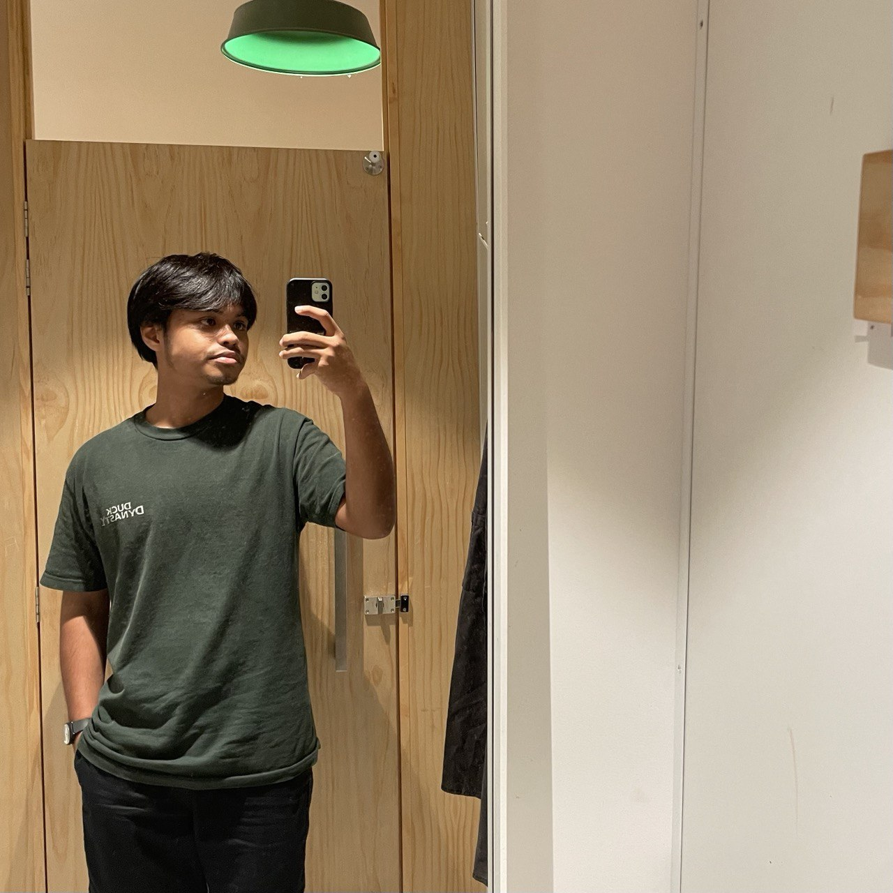

Hi My name is Alif Aiman
==================================================================================================================================

UTM student | Bachelor of Computer Science(Computer Network and Security)
-------------------------------------------------------------------------

A student who dreams to be a network administrator or cybersecurity analyst one day. My goal is to pursue my dream career and, finally, to bring my parents to Makkah.

## Skills 🛠️

### Socials ✨

 <a href="https://www.github.com/aalfmnsrr" target="_blank" rel="noreferrer"> <picture> <source media="(prefers-color-scheme: dark)" srcset="https://raw.githubusercontent.com/danielcranney/readme-generator/main/public/icons/socials/github-dark.svg" /> <source media="(prefers-color-scheme: light)" srcset="https://raw.githubusercontent.com/danielcranney/readme-generator/main/public/icons/socials/github.svg" />  </picture> </a> <a href="http://www.instagram.com/alfmnsrr" target="_blank" rel="noreferrer"> <picture> <source media="(prefers-color-scheme: dark)" srcset="https://raw.githubusercontent.com/danielcranney/readme-generator/main/public/icons/socials/instagram-dark.svg" /> <source media="(prefers-color-scheme: light)" srcset="https://raw.githubusercontent.com/danielcranney/readme-generator/main/public/icons/socials/instagram.svg" />  </picture> </a> <a href="https://www.linkedin.com/in/alif-aiman-084bab253/" target="_blank" rel="noreferrer"> <picture> <source media="(prefers-color-scheme: dark)" srcset="https://raw.githubusercontent.com/danielcranney/readme-generator/main/public/icons/socials/linkedin-dark.svg" /> <source media="(prefers-color-scheme: light)" srcset="https://raw.githubusercontent.com/danielcranney/readme-generator/main/public/icons/socials/linkedin.svg" />  </picture> </a> <a href="https://www.x.com/Alifmnsr" target="_blank" rel="noreferrer"> <picture> <source media="(prefers-color-scheme: dark)" srcset="https://raw.githubusercontent.com/danielcranney/readme-generator/main/public/icons/socials/twitter-dark.svg" /> <source media="(prefers-color-scheme: light)" srcset="https://raw.githubusercontent.com/danielcranney/readme-generator/main/public/icons/socials/twitter.svg" />  </picture> </a>

### Badges 💯

<b>My GitHub Stats</b>

## Education 🎓 

- Primary School - Sekolah Kebangsaan Desa Jasmin (2010 - 2015)
- Secondary School - Sekolah Menengah Kebangsaan Desa Cempaka (2016 - 2018)
- Electrical Engineering (Secondary School) - Tuaku Jaafar Technical Institute (2019 - 2020)
- Foundation in Physical Science - Negeri Sembilan Matriculation College (2021 - 2022)
- Bachelor Of Computer Science (Computer Network And Security) With Honours - University Teknologi Malaysia (2022-Now)

## Position 👊

<!-- Add your positions here -->

## Honors and Awards 🥇

- Dean's List - Negeri Sembilan Matriculation College (Semester I, Semester II)
- Dean's List - University Technology Malaysia (Semester I, Semester II, Semester III)
  

## Assignments 📑

- [Assignment 1: Report](https://github.com/aalfmnsrr/Web-Programming-23-24/blob/main/Assignment%201/Web%20Programming%20Assignment%20Group%208%20-%20Alif%20Aiman.pdf)
- [Assignment 2: Website](http://www.alif-aiman.rf.gd/)
- [Assignment 3: GitHub E-portfolio](https://github.com/your_github_username/your_eportfolio_repo)

## Projects 💻

- [Project Repository](https://github.com/aalfmnsrr/Web-Programming-23-24/tree/main/Project)
- [Project Website](https://alif-aiman-cem-hebak.000webhostapp.com/)

## Reflections

### 📄 Assignment 1: Report

**Summary:** In this assignment, I conducted a comparative evaluation of various hospital websites using Google Lighthouse. This task allowed me to analyze key performance metrics such as loading speed, accessibility, and SEO. By understanding these elements, I gained valuable insights into the importance of web performance optimization and the impact it has on user experience and search engine rankings.

**Improvement Suggestions:** To improve this assignment, I could incorporate additional web performance tools like GTmetrix or WebPageTest for a broader perspective. Additionally, examining a more diverse set of websites, including those from different industries, would provide a comprehensive understanding of common performance issues and best practices.

**Additional Reflections:** This assignment highlighted the critical role of performance audits in web development. It has inspired me to prioritize optimization in future projects. Furthermore, it underscored the need for continuous learning and adaptation to new tools and techniques in the ever-evolving field of web development.

### 🌐 Assignment 2: Website

**Summary:** In this assignment, I designed and developed a personal website landing page using HTML and CSS. According to the theme I chose, this task enhanced my skills in front-end web development, allowing me to create a visually appealing and responsive design. Through this project, I learned the importance of clean code and effective styling to improve the user experience and site aesthetics.

**Improvement Suggestions:** To improve this assignment, I could incorporate JavaScript to add interactivity and dynamic content. Additionally, implementing responsive design techniques using CSS frameworks like Bootstrap would ensure the landing page is optimized for various devices and screen sizes, enhancing accessibility and usability.

**Additional Reflections:** This assignment reinforced the significance of foundational web development skills. It inspired me to continue exploring advanced CSS techniques and modern design trends. Moreover, it highlighted the creative potential in web design, motivating me to experiment with new ideas and push the boundaries of my coding abilities.

### 🗃 Assignment 3: GitHub E-portfolio

**Summary:** In this assignment, I designed and developed my e-portfolio on GitHub. This project allowed me to showcase my skills and projects in a professional manner while learning to use GitHub Pages for web hosting. Through this task, I gained valuable experience in version control, project documentation, and collaborative development workflows.

**Improvement Suggestions:** To improve this assignment, I could enhance the e-portfolio by incorporating interactive elements using JavaScript and adding more detailed documentation for each project. Additionally, using a static site generator like Jekyll could simplify updates and maintenance, ensuring the e-portfolio remains current and relevant.

**Additional Reflections:** This assignment emphasized the importance of a well-crafted online presence in showcasing my abilities. It also highlighted the potential of GitHub as a powerful platform for hosting and version control. Moving forward, I plan to continually update my e-portfolio, integrating new projects and refining its design to reflect my growth as a developer.

### 💻 Project

**Summary:** In this project, I developed Hebak, an educational website offering lessons tailored for high school students. Through this endeavour, I aimed to provide a valuable resource for students to enhance their learning experience outside the classroom. This project allowed me to apply my technical skills in web development to create a platform with curated educational content.

**Improvement Suggestions:** To improve Hebak, I could implement features such as interactive quizzes, discussion forums, or personalized learning paths to engage students more effectively. Additionally, incorporating multimedia elements like videos and interactive simulations could enhance the learning experience and cater to different learning styles.

**Additional Reflections:** This project reinforced my belief in the transformative power of technology in education. It inspired me to continue exploring ways to leverage digital tools to make learning more accessible and engaging for students. Moreover, it highlighted the importance of user-centered design and accessibility considerations in developing educational platforms that cater to diverse learners.
